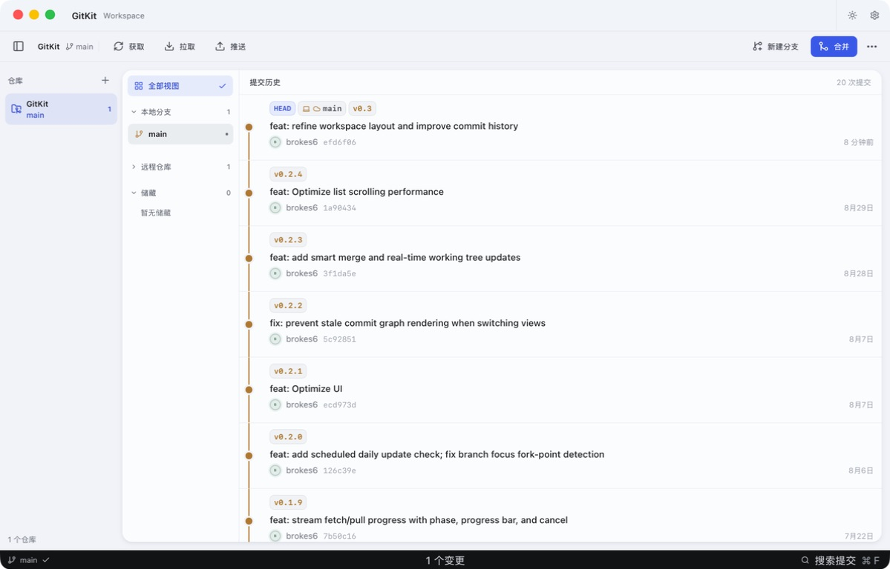
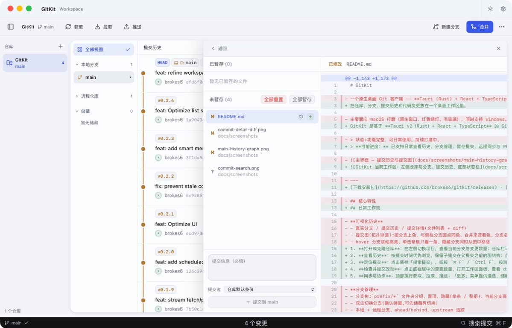
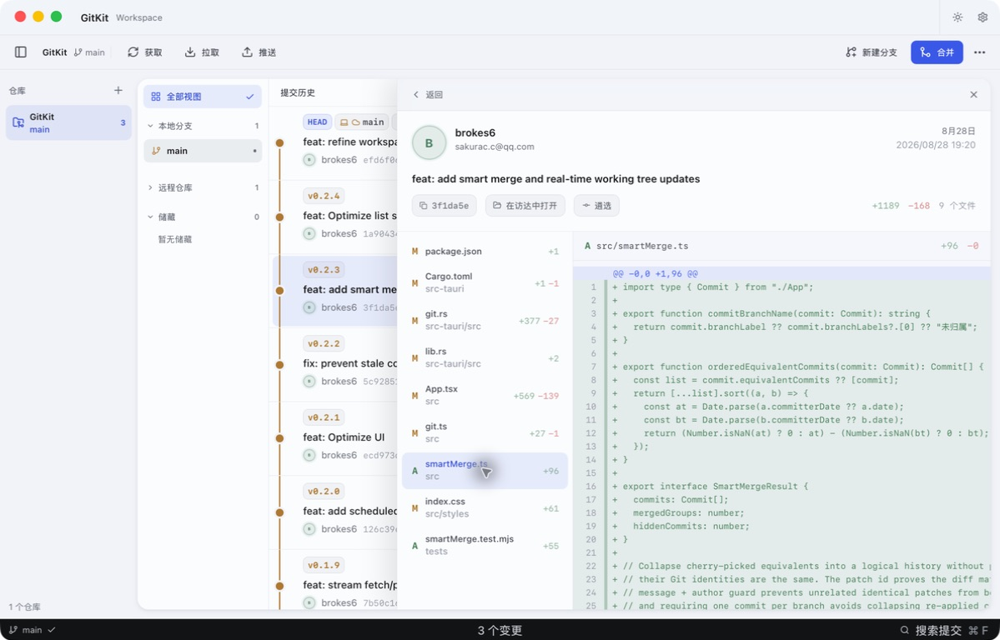
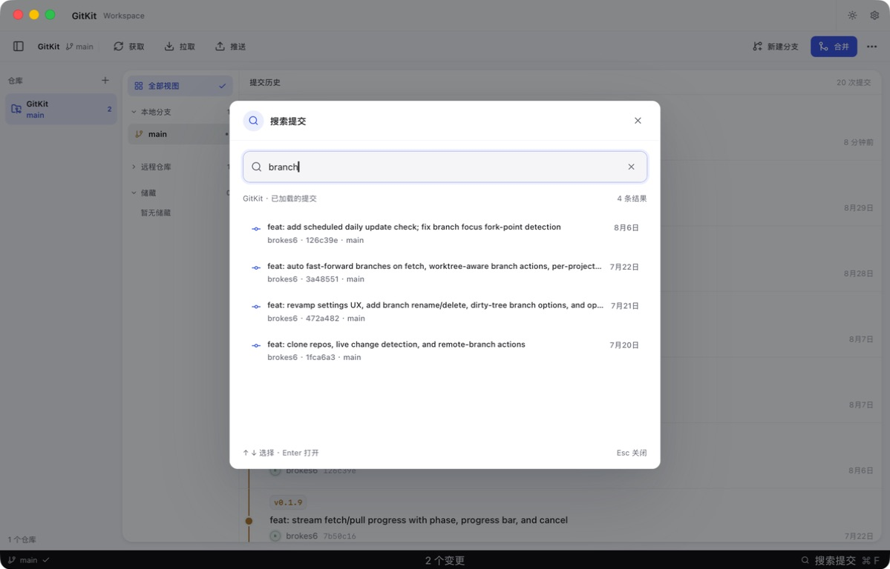
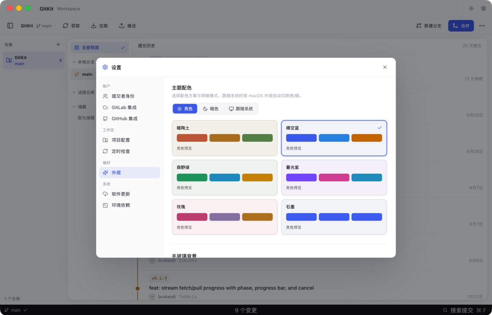
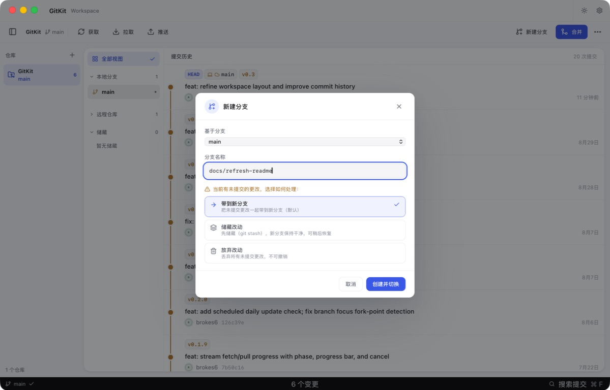
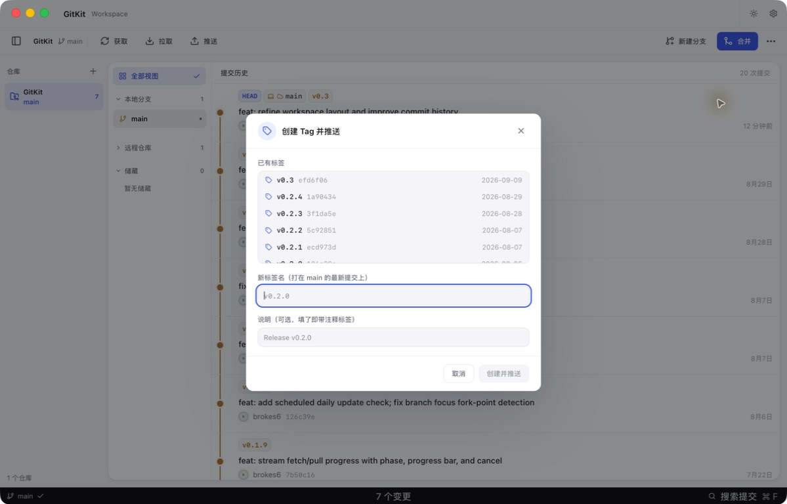

# GitKit

把仓库、分支、提交历史和代码变更放在一个桌面工作区里。

GitKit 是基于 **Tauri v2（Rust）+ React + TypeScript** 的 Git 客户端，主要围绕 macOS 打磨，同时提供 Windows 构建。后端调用系统 `git`，可以使用已有的 SSH key 和 Git 凭证管理器；GitHub / GitLab 的 PR、MR 等平台操作需要另外配置账号或 Token。

> **当前进度：** 已支持日常查看历史、分支管理、暂存提交、远程同步与 PR/MR 创建。近期完成了侧栏工作区、状态栏入口、居中搜索、历史时间排序和远程分支归属展示。独立的本地 Merge 操作与内置冲突编辑器仍待完善。



[下载安装包](https://github.com/brokes6/gitkit/releases) · [开发与架构说明](HANDOFF.md) · [发布指南](RELEASE.md)

## 日常工作流

1. **打开或克隆仓库**：在左侧切换项目，查看当前分支与变更数量；仓库栏可以收起，为历史和 diff 留出空间。
2. **查看历史**：按提交时间优先浏览，保留子提交在父提交之前的图结构；点击提交打开文件列表和 diff。
3. **定位提交**：点击底栏「搜索提交」，或按 `⌘ F` / `Ctrl F`，按消息、作者、分支或哈希搜索。用方向键选择、Enter 打开、Esc 关闭。
4. **检查并提交改动**：点击底栏居中的变更数量，打开工作区面板，查看 diff、选择暂存文件、填写提交信息与身份。
5. **同步与协作**：顶部执行获取、拉取、推送；「更多」菜单提供遴选、储藏、创建 Tag 并推送以及创建 PR/MR。

## 功能

### 工作区与历史

- 紧凑的仓库侧栏、带过渡动画的展开与收起，以及共用卡片的分支和历史区域。
- 底栏显示当前分支、同步状态图标与居中的变更数量；悬停同步图标查看上游和待推送、待拉取数量。
- 提交图根据分支归属上色；历史切换到另一分支时补充分支名称，连续同分支提交不重复堆叠标签。
- 本地与远程分支一起参与归属计算，关联上游与本地分支统一处理。
- **智能合并展示**：将满足条件的相同变更折叠为一行，可展开查看各次真实提交，也可切回原始提交。此功能只改变展示，不修改 Git 历史。
- 居中搜索窗口保持输入框高度稳定，支持键盘导航；搜索范围为当前仓库已加载的提交。
- 工作区文件监听，保存或外部修改文件后更新变更状态。

### 分支与远程

- 本地与远程分支树、`prefix/*` 文件夹分组、置顶、隐藏、悬停高亮与单分支聚焦。
- 创建、切换、重命名和删除分支；切换前可处理未提交改动。
- 识别被其他 worktree 占用的分支，并在相关操作前提示。
- Fetch / Pull / Push，显示同步数量；Fetch / Pull 支持阶段进度与取消。
- Fetch 后尝试快进可安全同步的本地分支；有未提交改动或分叉时跳过相应分支并提示。
- 可配置每日仓库更新检查，在应用运行期间执行；错过的检查在下次启动后补查，由用户选择同步发现的更新。

### 更改与提交

- 工作区文件列表、暂存选择、提交、单文件或全部丢弃改动。
- 提交详情、文件变更统计与 diff。
- Cherry-pick 预检查与冲突提示，可衔接 Kaleidoscope；冲突也可在外部解决后通过 Git 继续。
- 储藏的创建、列表、应用、删除，以及储藏文件与 diff 查看。
- Tag 创建与推送。

### 账号与协作

- 多套提交者身份，支持默认身份与项目级覆盖；提交时应用，不改写全局 Git 身份配置。
- 多 GitHub 账号与项目级账号选择记忆，支持 GitLab 连接配置与连接测试。
- 创建 GitHub PR / GitLab MR，提交前预览合并冲突。
- 无远程时可协助创建 GitHub 仓库并添加 remote。

### 外观与桌面集成

- macOS 原生窗口控件、可切换的毛玻璃效果、窗口位置与尺寸记忆。
- 六套配色：暖陶土、晴空蓝、森野绿、暮光紫、玫瑰、石墨；支持亮色、暗色和跟随系统。
- 系统字体、长列表滚动优化，以及减少动态效果偏好的适配。
- 应用更新检查、更新包签名校验与下载进度；Git / Git LFS 依赖检测。

## 界面预览

以下截图来自当前代码运行的 macOS 界面，使用 GitKit 仓库展示。

| 工作区更改与提交 | 提交详情与 diff |
| --- | --- |
|  |  |

| 居中搜索 | 主题与外观 |
| --- | --- |
|  |  |

| 新建分支 | Tag 管理 |
| --- | --- |
|  |  |

## 开发环境

运行安装包需要系统 `git`；使用 Git LFS 的仓库还需要 `git-lfs`。从源码开发需另外准备：

- **Node.js 22.22.3**：本次文档更新时使用的本地开发与测试版本。
- **Rust stable** 与 Cargo。
- **macOS**：Xcode Command Line Tools。
- **Windows**：MSVC 构建工具、Windows SDK 与 WebView2。

### 启动

```bash
npm ci
npm run tauri dev
```

首次启动会编译 Rust。前端由 Vite 热更新；Tauri CLI 监听 Rust 源码变更并重新编译。`npm run dev` 只启动前端服务，完整的 Git 功能需要 Tauri 后端。

### 检查

```bash
npx tsc --noEmit
npm run build
node --experimental-strip-types --test tests/*.test.mjs
cargo check --manifest-path src-tauri/Cargo.toml
```

回归测试覆盖智能合并、时间优先排序、父子关系、远程分支归属和分支切换标注。原生窗口、系统 Git 交互与界面效果仍需在 Tauri 中验证。

### 打包

```bash
# 当前平台
npm run tauri build

# macOS 通用二进制（Apple Silicon + Intel）
rustup target add aarch64-apple-darwin x86_64-apple-darwin
npm run tauri build -- --target universal-apple-darwin
```

产物位于对应 target 的 `release/bundle/` 目录。CI 在 `v*` tag 推送时构建 macOS 通用包与 Windows x64 安装包，先创建草稿 Release，发布后供下载和更新使用。CI 会从 tag 写入版本号，源码中的版本占位值不代表最新发布版本。

更新包签名与操作系统代码签名是两件事；当前发布工作流未配置 Apple / Windows 代码签名。发布、签名、公证与更新分发说明见 [RELEASE.md](RELEASE.md)。

## 开发进度

| 模块 | 状态 | 当前范围 |
| --- | --- | --- |
| 工作区布局 | 已实现 | 仓库侧栏、收起动画、紧凑工具栏、底栏入口 |
| 历史与提交图 | 已实现 | 时间优先排序、分支归属、智能合并展示、提交详情 |
| 提交搜索 | 已实现 | 已加载历史内搜索、居中弹窗、键盘导航 |
| 工作区更改 | 已实现 | 文件监听、diff、暂存提交、丢弃改动 |
| 分支与同步 | 已实现 | 分支管理、worktree 提示、Fetch / Pull / Push、每日检查 |
| 协作与身份 | 已实现 | 多身份、多 GitHub 账号、PR/MR 创建与冲突预览 |
| 本地 Merge | 待完善 | 工具栏目前仅提供引导提示，尚未接通独立合并流程 |
| 内置冲突编辑器 | 待实现 | 当前通过冲突提示与外部工具处理 |
| 全仓库历史搜索 | 待扩展 | 当前读取最多 400 条历史，搜索最多展示 80 条匹配结果 |
| Token 安全存储 | 待迁移 | 从 localStorage 迁移到系统钥匙串或安全存储 |

## 实现与边界

- **系统 Git**：Rust 调用系统 `git`，通过阻塞线程池执行命令；GUI 环境会补充常见工具安装目录到 PATH。已有 Git 凭证可复用，但网络权限、SSH 配置与平台 API Token 仍需用户配置。
- **历史排序**：读取历史使用 `--date-order`，优先按提交者时间展示并保持父子顺序。智能合并后的逻辑行采用同样的约束，以组内最近一次提交作为展示时间；折叠导致环时退回原始历史。
- **分支归属**：沿分支尖端的第一父提交链回溯，为图线和分支上下文提供归属。共享祖先可能属于多条分支；这里的展示归属不代表 Git 保存了提交最初创建时的分支名。
- **Hooks**：部分切换、同步及遴选操作会禁用客户端 hooks，另有缺失 Git LFS 时的重试处理，因此不承诺与手动命令行执行完全一致。
- **Token**：目前保存在本机 WebView 的 localStorage，尚未接入系统钥匙串；请按所需功能授予权限。
- **macOS 分发**：毛玻璃实现启用了私有 API，当前配置不适合 Mac App Store 分发。更新签名私钥应离线备份，详见发布指南。

## 目录结构

```text
GitKit/
├── README.md                 # 使用、功能与开发进度
├── HANDOFF.md                # 架构与数据流说明
├── RELEASE.md                # 发布、签名与更新说明
├── docs/screenshots/         # 当前界面截图
├── tests/                    # 历史归属与智能合并回归测试
├── src/
│   ├── main.tsx              # React 入口
│   ├── App.tsx               # UI 与应用状态
│   ├── git.ts                # Git API、类型映射与提交图
│   ├── smartMerge.ts         # 相同变更折叠与逻辑历史排序
│   └── styles/               # Tailwind CSS v4 与界面样式
└── src-tauri/
    ├── tauri.conf.json       # 应用与打包配置
    ├── capabilities/         # 前端调用权限
    └── src/
        ├── main.rs, lib.rs   # 原生入口、插件与命令注册
        └── git.rs            # Git 命令与工作区文件监听
```

## 许可证

[Apache-2.0](LICENSE)
