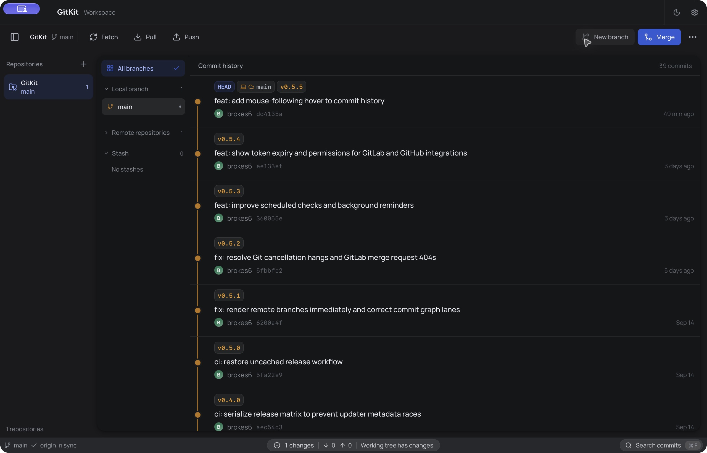
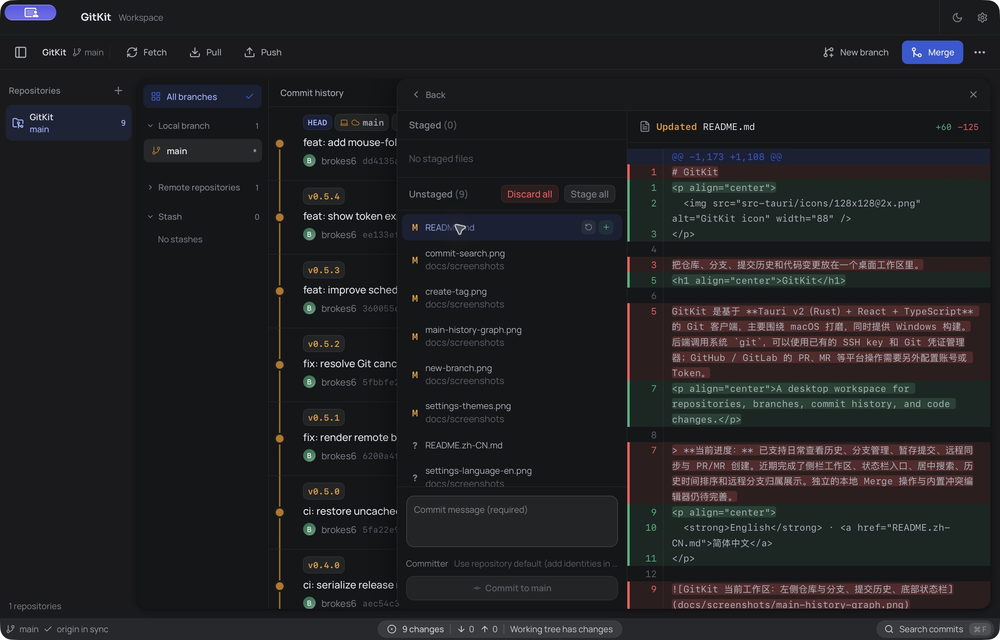
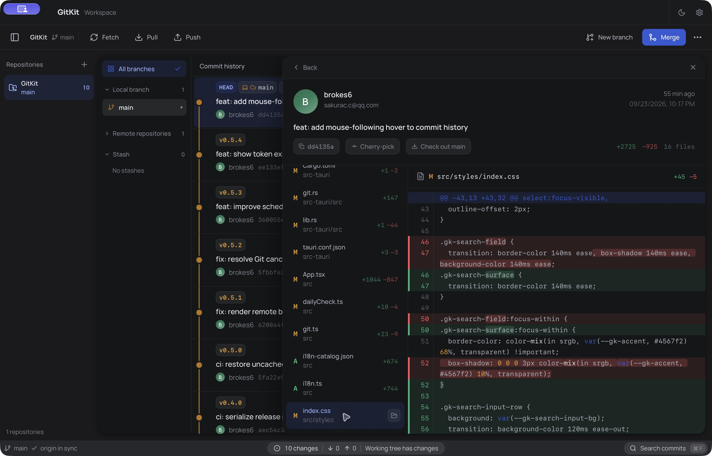
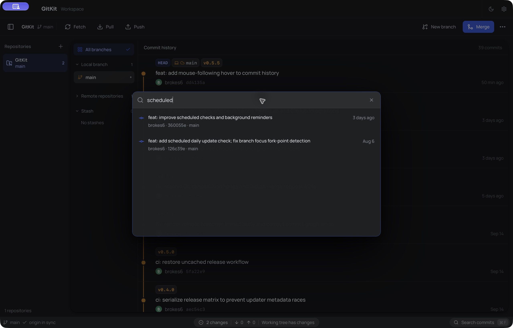
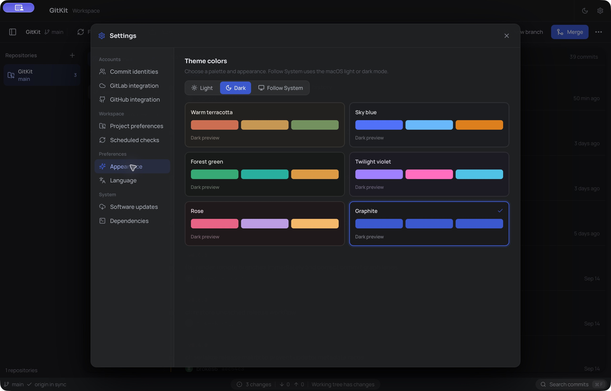
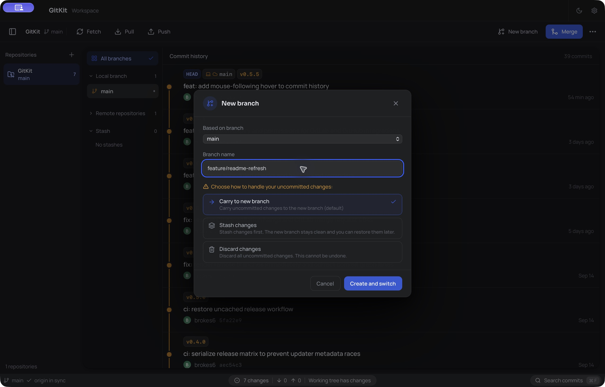
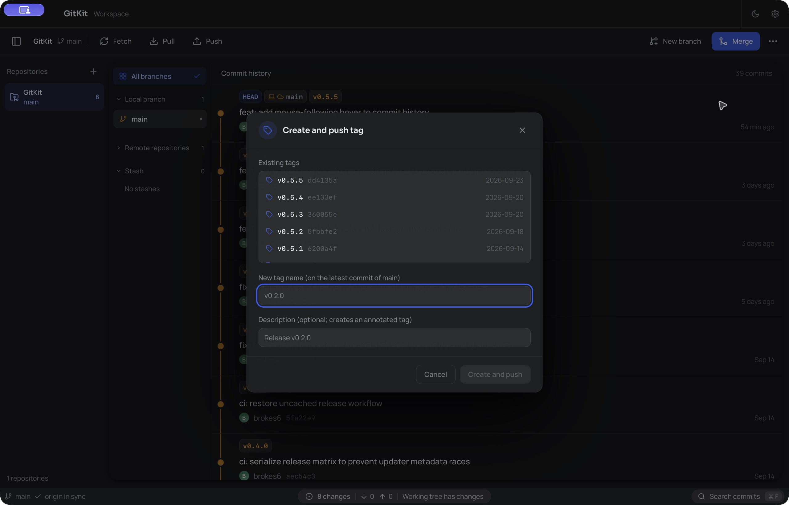
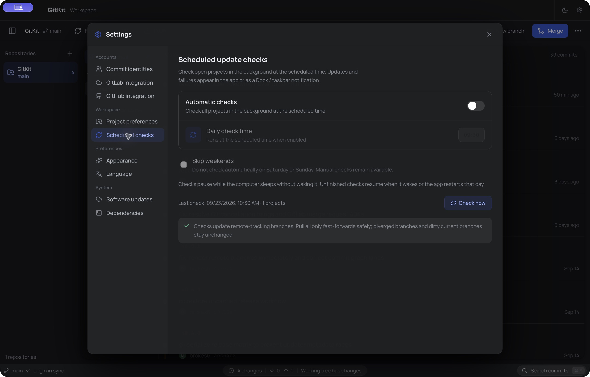
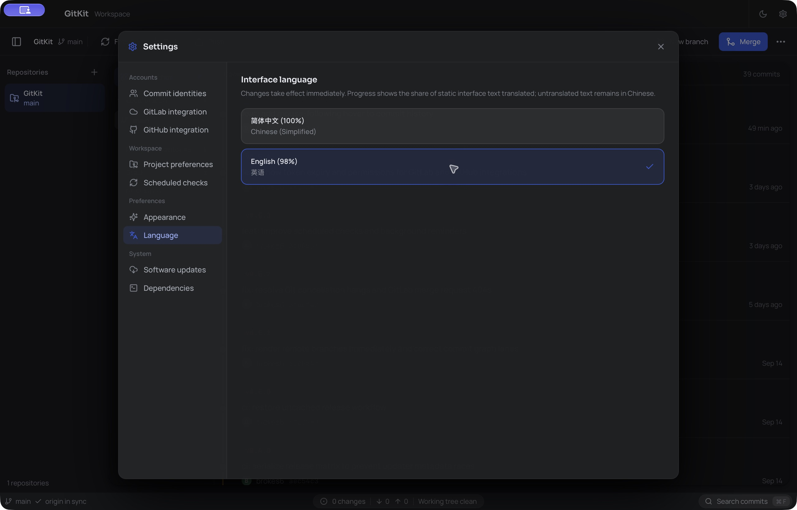

<p align="center">
  
</p>

<h1 align="center">GitKit</h1>

<p align="center">在一个桌面工作区中管理仓库、分支、提交历史与代码变更。</p>

<p align="center">
  <a href="README.md">English</a> · <strong>简体中文</strong>
</p>

<p align="center">
  <a href="https://github.com/brokes6/gitkit/releases">下载安装包</a> ·
  <a href="HANDOFF.md">架构说明</a> ·
  <a href="RELEASE.md">发布指南</a>
</p>

GitKit 基于 **Tauri v2、Rust、React 和 TypeScript** 构建。后端调用系统 `git`，可以使用已有的 SSH key 和 Git 凭证管理器；GitHub、GitLab 的平台操作需要另外配置账号或 Token。界面支持英语和简体中文。



## 主要功能

| 浏览 | 修改 | 协作 |
| --- | --- | --- |
| 查看提交图和差异、聚焦分支、搜索历史。 | 检查工作区、暂存与提交文件，管理分支、储藏和 Tag。 | 获取、拉取、推送，以及创建 GitHub PR 和 GitLab MR。 |

### 仓库与历史

- 打开或克隆仓库，在项目侧栏中切换。
- 浏览带有本地与远程分支归属、Tag 和作者信息的提交图，查看提交差异。分支可置顶、隐藏、聚焦，并按 `feature/*` 这类名称分组。
- **智能合并展示**将符合条件的相同变更折叠为一行，也可展开查看原始提交。它只改变展示，不改写 Git 历史。
- 使用 `⌘ F` / `Ctrl F` 按消息、作者、分支或哈希搜索已加载的提交，并用方向键、Enter 和 Esc 操作。

### 更改与同步

- 监听工作区文件变更、查看差异、选择文件暂存和提交、选择提交者身份，以及丢弃改动。
- 创建、切换、重命名和删除分支。分支被其他 worktree 占用或切换时存在未提交改动，会给出提示和处理选项。
- Fetch、Pull、Push 显示进度；Fetch 和 Pull 可取消。Fetch 会尝试快进可安全同步的本地跟踪分支，并报告跳过的分支。
- 创建和查看储藏、在预检查冲突后遴选提交，以及创建或推送 Tag。
- 为已打开的仓库设置每日更新检查，可选择跳过周末。检查只更新远程跟踪信息，是否同步由你决定；休眠中断后会在符合条件时恢复或下次启动时补查。

### 账号与桌面偏好

- 配置多个 GitHub 账号和 GitLab 集成，包括自建 GitLab。平台提供相关信息时，可查看 Token 有效期和权限。
- 创建 GitHub PR 或 GitLab MR 前预览合并冲突；本地仓库没有 remote 时，可协助创建 GitHub 仓库并添加 remote。
- 在英语和简体中文之间切换，选择六套配色，以及亮色、暗色或跟随系统的外观。
- 保存多套提交者身份及项目级选择，无须改动全局 Git 身份配置。应用还能记住窗口位置与尺寸、适配减少动态效果偏好、检测 Git / Git LFS 依赖，并支持签名校验的应用内更新。

## 界面预览

以下截图由本地 `npm run tauri dev` 启动的开发版拍摄，打开的是 GitKit 仓库。可以在 **设置 → 语言** 切换应用语言。

| 工作区更改 | 提交差异 |
| --- | --- |
|  |  |

| 提交搜索 | 外观设置 |
| --- | --- |
|  |  |

| 分支 | Tag |
| --- | --- |
|  |  |

| 定时检查 | 界面语言 |
| --- | --- |
|  |  |

## 从源码运行

运行需要系统 `git`；使用 Git LFS 的仓库还需要 `git-lfs`。开发还需要 [.nvmrc](.nvmrc) 指定版本的 Node.js、稳定版 Rust 与 Cargo，以及平台构建工具：macOS 的 Xcode Command Line Tools，或 Windows 的 MSVC、Windows SDK 与 WebView2。

```bash
npm ci
npm run tauri dev
```

首次运行会编译 Rust。Vite 热更新前端，Tauri 重新编译原生代码。`npm run dev` 只启动前端，无法提供 Tauri 实现的 Git 命令。

<details>
<summary>检查与打包</summary>

```bash
npx tsc --noEmit
npm run build
node --experimental-strip-types --test tests/*.test.mjs
cargo check --manifest-path src-tauri/Cargo.toml

# 为当前平台打包
npm run tauri build
```

发布工作流会在推送 `v*` Tag 时构建 macOS 通用包和 Windows x64 安装包。签名、公证和更新分发参见 [RELEASE.md](RELEASE.md)。更新包签名与操作系统代码签名是两件事。

</details>

## 当前边界

- 工具栏的**合并**尚未接通独立的本地 Merge 流程。遴选提交有冲突提示，但尚无内置冲突编辑器。
- 提交搜索只覆盖当前已加载的历史（最多 400 条提交），最多展示 80 条匹配结果。
- 平台 Token 当前保存在本机 WebView 的 `localStorage`，尚未迁移到系统钥匙串。请只授予所需权限。
- 后台检查在应用运行期间执行。休眠会中断正在进行的检查，应用会在唤醒后或之后启动时补查符合条件的日期。

## 许可证

[Apache-2.0](LICENSE)
