<p align="center">
  
</p>

<h1 align="center">GitKit</h1>

<p align="center">在一个桌面工作区中管理仓库、分支、提交历史与代码变更。</p>

<p align="center">
  <a href="README.md">English</a> · <strong>简体中文</strong>
</p>

<p align="center">
  <a href="https://github.com/brokes6/gitkit/releases">下载安装包</a> ·
  <a href="HANDOFF.md">架构说明</a> ·
  <a href="RELEASE.md">发布指南</a>
</p>

GitKit 基于 **Tauri v2、Rust、React 和 TypeScript** 构建。后端调用系统 `git`，可以使用已有的 SSH key 和 Git 凭证管理器；GitHub、GitLab 的平台操作需要另外配置账号或 Token。界面支持英语和简体中文。

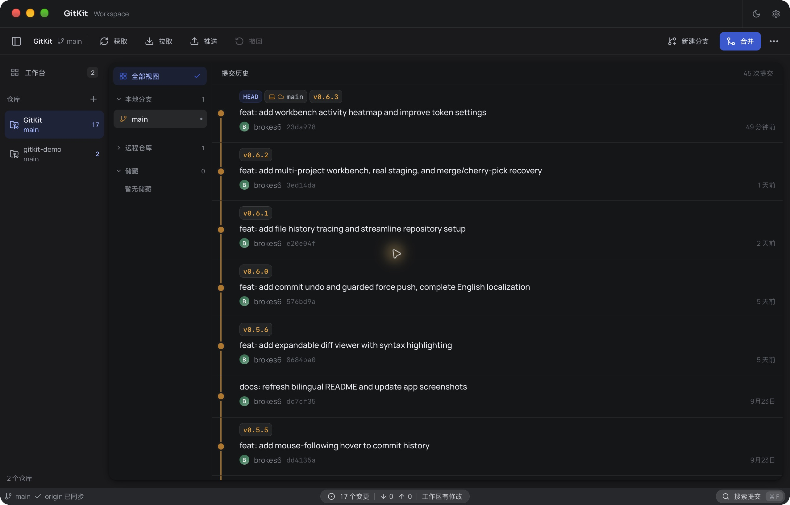

## 主要功能

| 浏览 | 修改 | 协作 |
| --- | --- | --- |
| 查看提交图和差异、聚焦分支、搜索历史。 | 检查工作区、暂存与提交文件，管理分支、储藏和 Tag。 | 获取、拉取、推送，以及创建 GitHub PR 和 GitLab MR。 |

### 仓库与历史

- 打开仓库或普通项目文件夹，也可克隆仓库，在项目侧栏中切换。未初始化 Git 的文件夹可点击**推送**并确认初始化，现有文件保持原样；完成后再次点击推送，可创建并连接远程仓库。
- 进入**工作台**，通过紧凑项目列表查看整体状况，默认显示需关注的项目：冲突、未完成 Git 操作、工作区改动、待推送提交、已知上游更新和检查异常；筛选或搜索后可进入对应流程。顶部操作可刷新全部项目的本地状态与提交活动、检查远程更新或添加项目。本地刷新只读，同步单独操作，应用会记住上次使用的页面。
- 查看最近 **12 个月的本地提交活动**，覆盖所有已添加项目，按作者邮箱匹配设置中配置的全部提交者身份。其他作者不计入，未配置身份时显示零活动。日历按提交者日期和本机时区汇总，包含未推送提交，同一提交 ID 在多个克隆或工作树中只计一次。点击日期可查看当天涉及的项目并进入项目历史；读取失败时会提示统计不完整，无须 GitHub 账号。
- 浏览带有本地与远程分支归属、Tag 和作者信息的提交图，查看提交差异。分支可置顶、隐藏、聚焦，并按 `feature/*` 这类名称分组。
- 展开文件差异以获得更大的阅读空间，查看语法高亮，并在文件和更改点之间导航。
- 从提交的文件差异中打开**文件追溯**，查看包含重命名的改动历史。可选择截至所选提交或当前分支最新历史，逐次查看差异，并切换**逐行归属**查看作者与来源提交。
- **智能合并展示**将符合条件的相同变更折叠为一行，也可展开查看原始提交。它只改变展示，不改写 Git 历史。
- 使用 `⌘ F` / `Ctrl F` 按消息、作者、分支或哈希搜索已加载的提交，并用方向键、Enter 和 Esc 操作。

### 更改与同步

- 按整文件操作 Git 真实暂存区，分别查看 HEAD → 暂存区、暂存区 → 工作区的差异；同一文件可以同时出现在两区。提交直接使用已检查的暂存内容，尊重外部工具的部分暂存，保留未暂存及提交前新产生的工作区编辑；暂存区或 HEAD 变化时需刷新检查后重试。提交身份和草稿按项目保存。
- 确认**撤回**最近一次未推送提交，文件改动保留在工作区并转为未暂存；也支持撤回首次提交。
- 监听工作区及 linked worktree 的 Git 元数据变更，丢弃改动前进行确认。
- 创建、切换、重命名和删除分支。分支被其他 worktree 占用或切换时存在未提交改动，会给出提示和处理选项。
- 预览合并方向、改动文件及可能的冲突，再将分支合入当前分支；开始前要求工作区与暂存区干净。切换项目或重启应用后，仍可查看暂停的合并；解决并暂存冲突后，可编辑合并说明并继续，也可中止。解决后的暂存内容即使与 HEAD 相同，仍可完成合并。有 Kaleidoscope 时可调用它解决冲突。
- Fetch、Pull、Push 显示进度；Fetch 和 Pull 可取消。Fetch 会尝试快进可安全同步的本地跟踪分支，并报告跳过的分支。
- 本地与远程历史分叉时，可先检查推送目标及远程独有提交，再输入远程分支名确认**强制推送**。GitKit 使用 `--force-with-lease` 校验远程版本，并在本地保留原远程分支顶端的恢复引用。
- 预检查冲突后，使用 Cherry-pick 复制提交。暂停的 Cherry-pick 复用合并的悬浮冲突栏、真实暂存及可选 Kaleidoscope 流程，检查暂存内容后再继续，保留原提交作者和说明。切换项目或重启应用后，仍可继续或中止，也支持其他工具发起的序列；中止会返回整个序列开始前的状态。
- 创建和查看储藏，以及创建或推送 Tag。
- 为已打开的仓库设置每日更新检查，可选择跳过周末。检查只更新远程跟踪信息，是否同步由你决定；休眠中断后会在符合条件时恢复或下次启动时补查。

### 账号与桌面偏好

- 配置多个 GitHub 账号，包括 GitHub Enterprise，以及自建 GitLab 集成。平台提供相关信息时，可查看 Token 有效期和权限。
- 点击**管理 Token**，在浏览器中打开平台的令牌设置页。GitHub 根据令牌类型和配置的公共或 Enterprise 实例跳转，GitLab 使用你填写的实例地址。
- 在本次应用会话中重新打开账号设置，会复用五分钟内成功读取的 Token 资料；超过复用时间后，在后台更新期间仍显示上次内容。可手动刷新获取当前信息，保存新实例地址或 Token 后会读取对应资料。
- 创建 GitHub PR 或 GitLab MR 前预览合并冲突；本地仓库没有 remote 时，可创建 GitHub 或 GitLab 仓库并连接。尚无提交时，先在本地提交文件，再推送。
- 在英语和简体中文之间切换，选择六套配色，以及亮色、暗色或跟随系统的外观。
- 保存多套提交者身份及项目级选择，无须改动全局 Git 身份配置。应用还能记住窗口位置与尺寸、适配减少动态效果偏好、检测 Git / Git LFS 依赖，并支持签名校验的应用内更新。

## 界面预览

以下截图从当前源码运行的 Tauri 开发窗口拍摄，展示 GitKit 与本地演示仓库。界面使用简体中文，Token 表单无真实凭据，可以在 **设置 → 语言** 切换应用语言。

| 工作台提交活动 | GitHub Token 设置 |
| --- | --- |
| 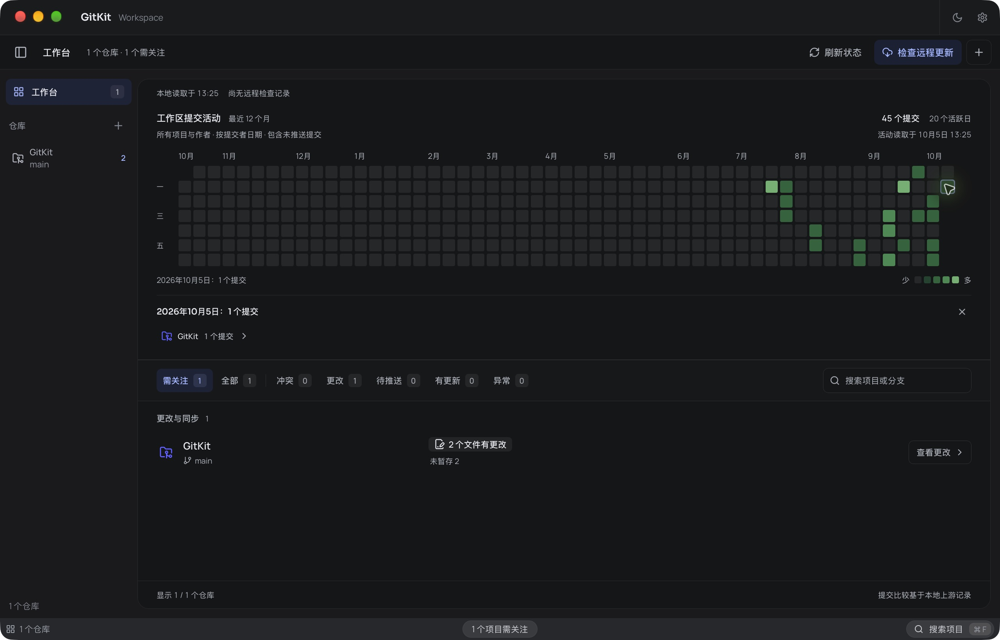 | 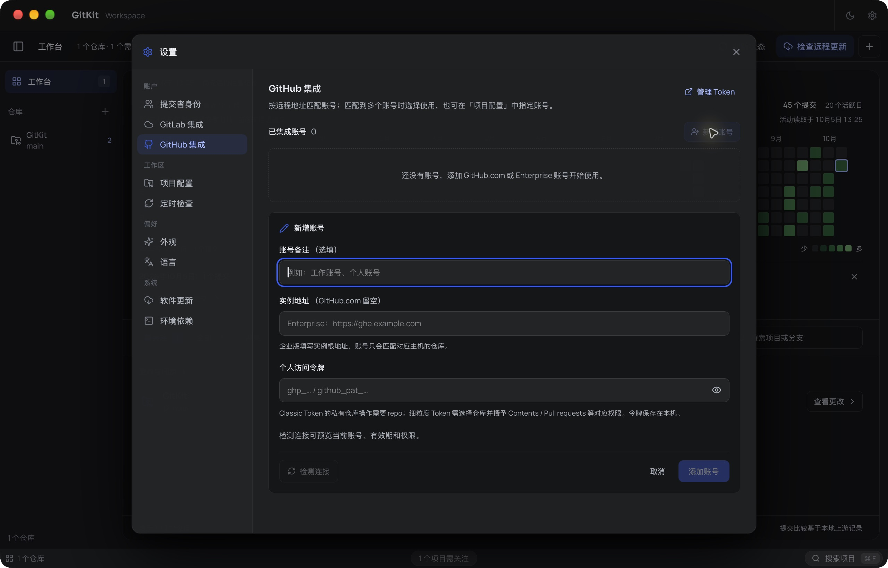 |

| 撤回提交 | 合并预览 |
| --- | --- |
| 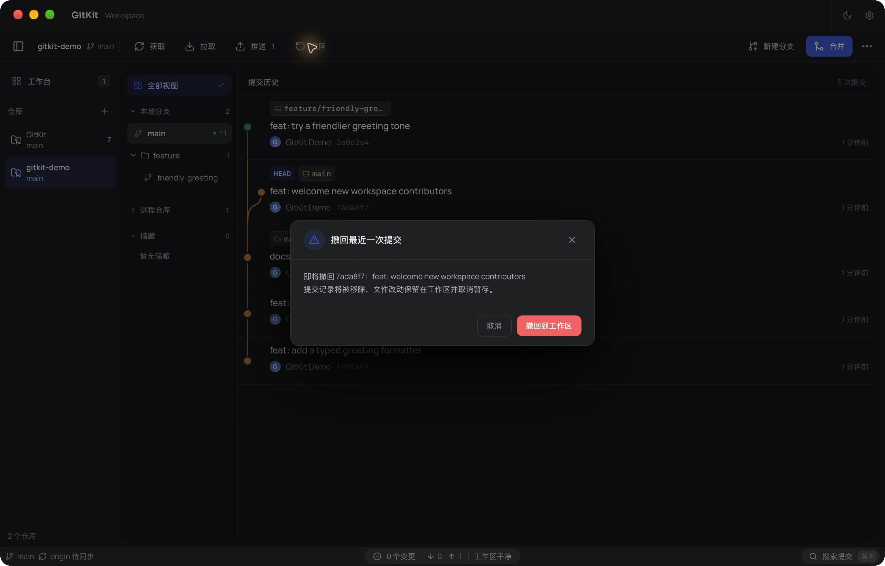 | 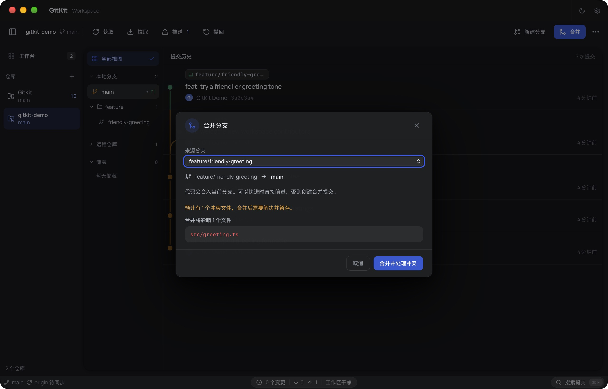 |

| 工作区更改 | 展开代码差异 |
| --- | --- |
| 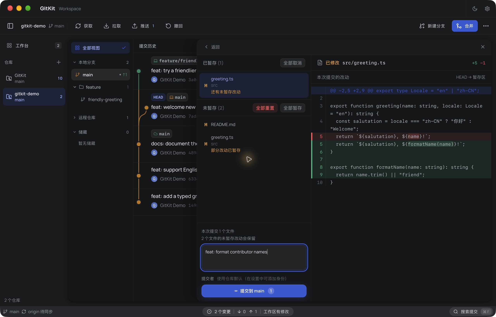 | 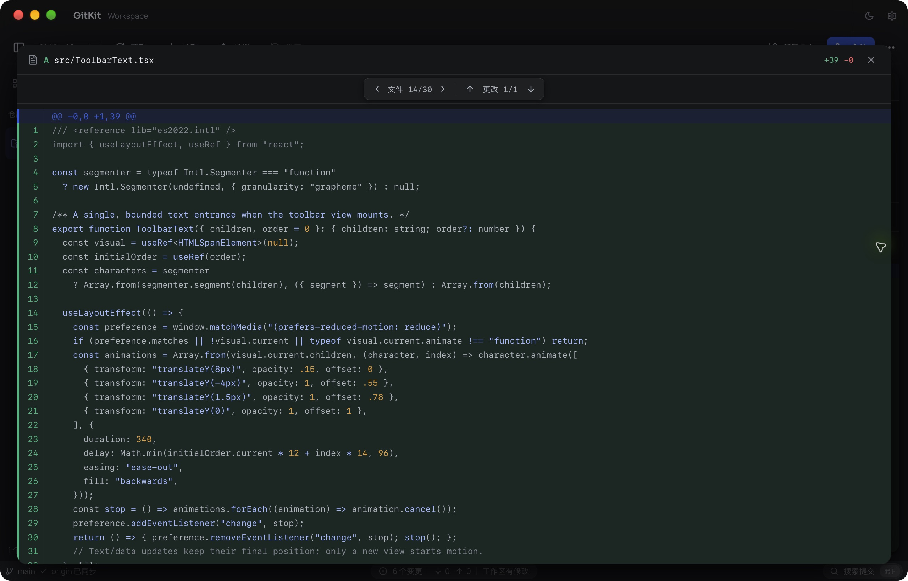 |

**文件历史与逐行归属**

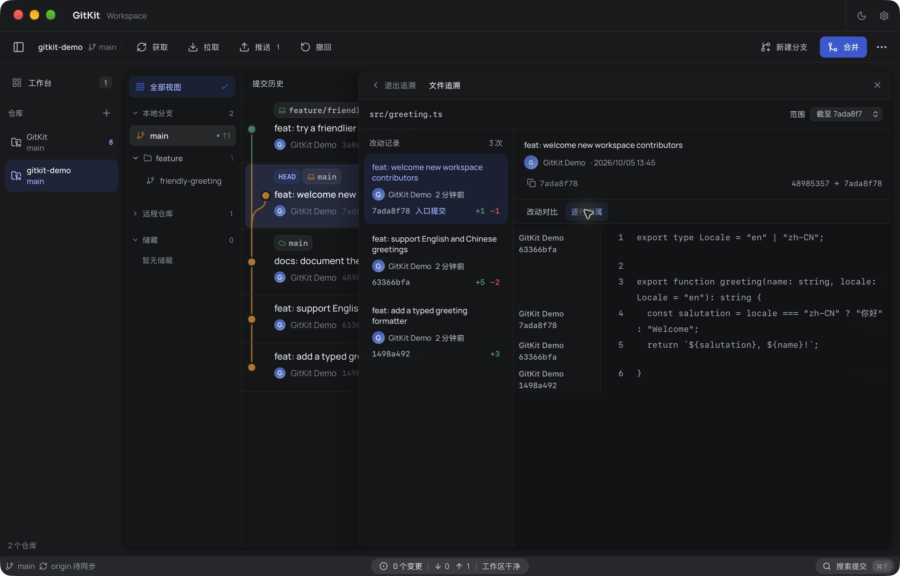

| 提交搜索 | 外观设置 |
| --- | --- |
| 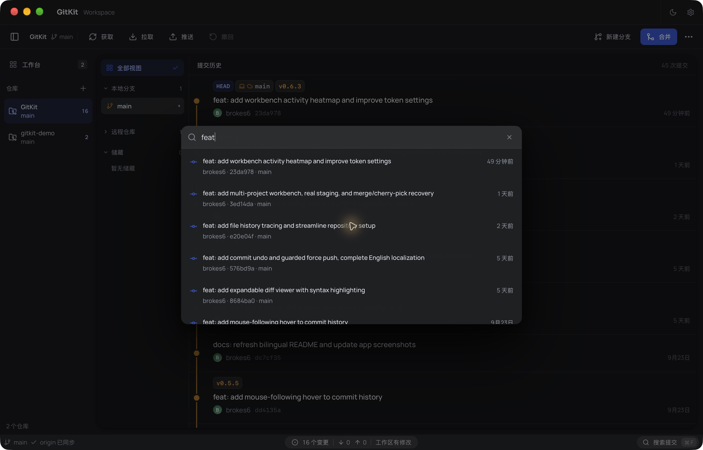 | 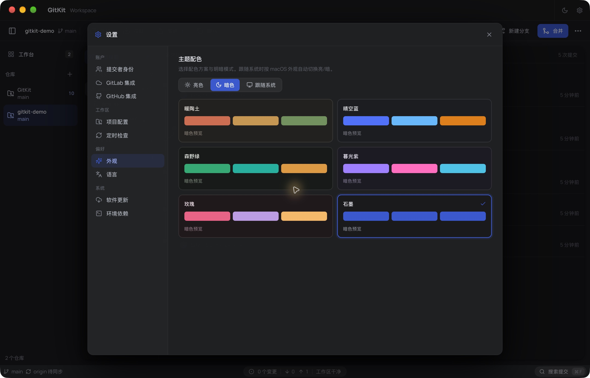 |

| 分支 | Tag |
| --- | --- |
| 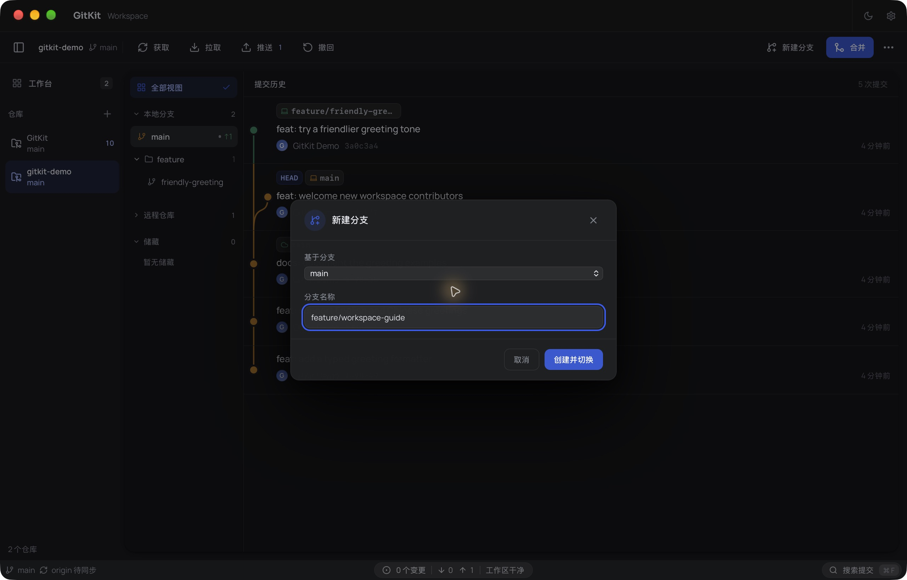 | 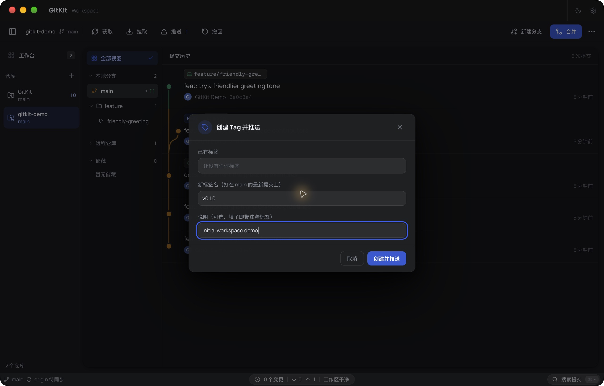 |

| 定时检查 | 界面语言 |
| --- | --- |
| 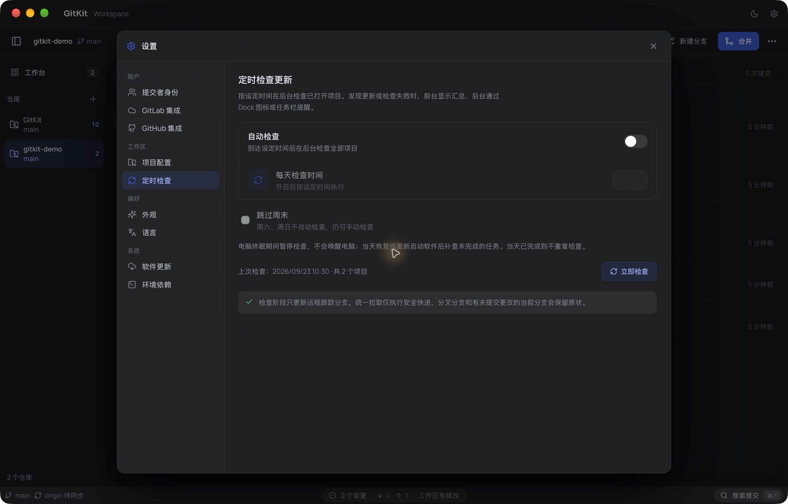 | 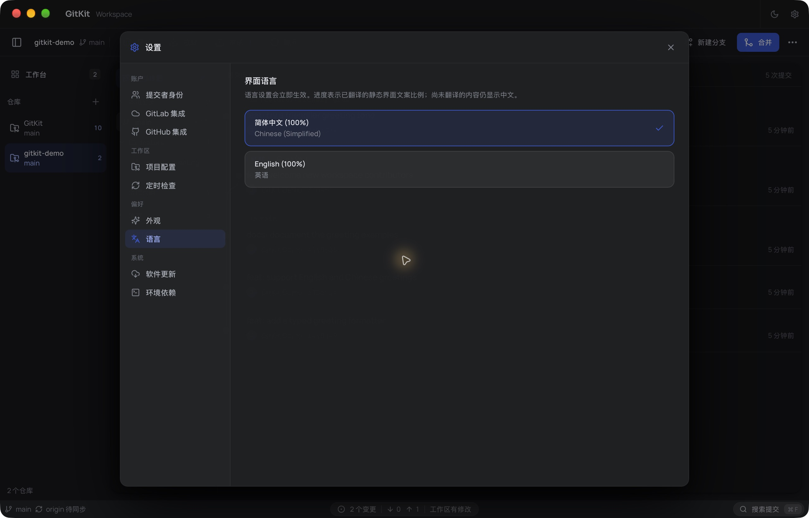 |

## 从源码运行

运行需要系统 `git`；使用 Git LFS 的仓库还需要 `git-lfs`。开发还需要 [.nvmrc](.nvmrc) 指定版本的 Node.js、稳定版 Rust 与 Cargo，以及平台构建工具：macOS 的 Xcode Command Line Tools，或 Windows 的 MSVC、Windows SDK 与 WebView2。

```bash
npm ci
npm run tauri dev
```

首次运行会编译 Rust。Vite 热更新前端，Tauri 重新编译原生代码。`npm run dev` 只启动前端，无法提供 Tauri 实现的 Git 命令。

<details>
<summary>检查与打包</summary>

```bash
npx tsc --noEmit
npm run build
node --experimental-strip-types --test tests/*.test.mjs
cargo check --manifest-path src-tauri/Cargo.toml

# 为当前平台打包
npm run tauri build
```

发布工作流会在推送 `v*` Tag 时构建 macOS 通用包和 Windows x64 安装包。签名、公证和更新分发参见 [RELEASE.md](RELEASE.md)。更新包签名与操作系统代码签名是两件事。

</details>

## 当前边界

- 冲突编辑使用外部工具，尚无内置冲突编辑器。合并和 Cherry-pick 可在应用中继续或中止；暂停的 Revert 和 Rebase 可识别，但需要在终端完成。
- Cherry-pick 暂存区为空、原说明为空、说明被外部改写，以及 `--no-commit` 等特殊序列，需在终端明确处理；已识别的暂停序列仍可中止。
- 撤回是否可用依据本地已知的远程跟踪记录，可先 Fetch 更新这些信息。
- 逐行归属仅预览支持的文本文件的前 2,000 行。
- 提交搜索只覆盖当前已加载的历史（最多 400 条提交），最多展示 80 条匹配结果；提交活动日历单独读取最近 12 个月的历史，不受此限制。
- 提交活动只统计本地可达历史，排除储藏和仅保存在 reflog 中的提交。已知远程历史取决于上次 fetch，日历不代表 GitHub 账号贡献图。
- 平台 Token 当前保存在本机 WebView 的 `localStorage`，尚未迁移到系统钥匙串。请只授予所需权限。
- 后台检查在应用运行期间执行。休眠会中断正在进行的检查，应用会在唤醒后或之后启动时补查符合条件的日期。

## 许可证

[Apache-2.0](LICENSE)
